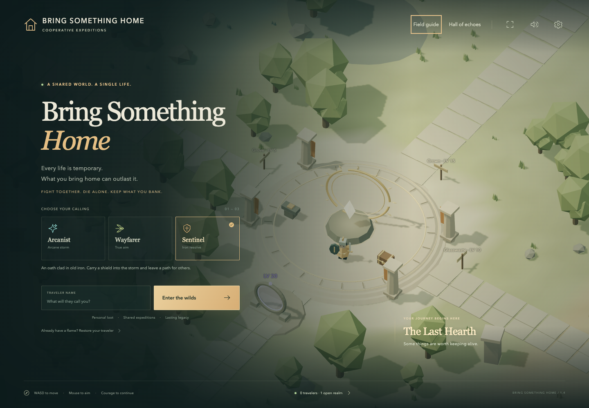

# Bring Something Home

**Every life is temporary. What you bring home can outlast it.**

An original 3D cooperative bullet-hell RPG about heading out together, surviving
readable projectile patterns, and banking what you want to keep. Shared expeditions
lead through forests, crystal wastes, drowned libraries, and the Crown of Ash.
Death takes carried gear; banked equipment and account legacy outlast each traveler.

[Play online](https://bring-something-home.fly.dev/) ·
[Portfolio](https://aj8uppal.github.io/built/#bring-something-home)

Use the expand icon on the title screen or minimap, or the Fullscreen control in
Settings, to fill your display. Press Esc to leave fullscreen.



## Play locally

Requires **Node.js 24.15 or newer** and a browser with WebGL2.

```sh
npm ci
npm run dev
```

Open **http://127.0.0.1:5173**. This starts both the browser client and the realm
server. Enter a name, choose a calling, and play. There are no API keys, external
services, paid assets, or account providers to configure.

The realm server uses port **8790**. To change it, run
`SERVER_PORT=8795 npm run dev`. Progress lives in `data/emberwilds.sqlite`.
Do not delete that database unless you intend to erase all accounts.

## The complete play loop

- **Three callings:** the Arcanist’s projectile-erasing nova, the Wayfarer’s
  piercing volley, and the Sentinel’s protective healing ward. Every class has
  ranged primary fire and an invulnerable dodge.
- **A shared 3D realm:** an island of five regions with three wardens and an Ashen
  Sovereign, wrapped by an outer ring of seven biomes for levels 15 to 40 — the
  Drowned Coast, the Petrified Orchard, the Salt Flat, the Shattered Observatory,
  the Bone Marsh, the Glacier of Fused Glass, and the Ashfall behind the Crown. A
  ring road, seven spokes and three one-way passes home join them. Each biome has
  its own ground, weather, ambient chord, resident keeper, and creatures that
  travel in packs rather than standing where they spawned.
- **Doors everywhere:** nine dungeon templates, generated from a seed every time —
  three to six chambers, optional side rooms, one secret. Creatures drop doors:
  hunt a family long enough and one of its own opens in the world for eighty
  seconds, announced by name and place, open to anybody who runs there. Any door
  can be opened at depth one to five for harder fights and better rewards.
- **Twelve setpieces and five events:** shrines, ambush hollows, a treasure
  caravan, lantern circles and splitter nests, drawn from the realm seed so the
  same landmark is a different fight in the next realm; a wandering star, a
  meteor, a cinder tide, and two processions that have to be walked home.
- **Bullet-hell combat:** aimed shots, fans, rings, spirals, and layered bursts.
  Local movement, aim, dodge, and firing feedback respond immediately. Enemies
  commit to visible attack windups; bosses alternate patterns through three phases
  and scale health to the group that engages them.
- **Sight lines:** a player-centred minimap with three ranges and edge chevrons for your
  objective, live portals, bosses and events; an atlas that names every place with its level
  band and drop tier, dims what you have not visited, and lets you pin a destination; a build
  readout in the rail giving health, light, damage, rate, range, speed, armour and damage per
  second, with an ember pip when a stat is as high as its tier allows; and an objective board
  under J listing every unlocked thing worth doing, each with its reward, level and distance.
- **Shown, not briefed:** a new traveler spawns facing north with two creatures
  in view just outside the sanctuary. A three-line banner above the hotbar fades on
  the first step; there is no entry modal. The first arc is the tutorial: kill three
  at the gate, take the bag that drops, wear what is inside, then push north. One
  objective card at a time; hunt contracts and the Wandering Star appear later.
  Signposts at the three road forks, level numbers on every dungeon portal, light
  columns above living wardens, and ground and fog graded per zone show difficulty
  in the world. The HUD, journal, and map agree on your next task, destination,
  progress, reward, preparation, and next unlock. Real-time seal status keeps the
  compass away from fallen wardens.
- **Progression:** 30 levels, eight chapters with guaranteed equipment caches,
  gold, four loot rarities, three equipment slots, an 18-slot satchel, a 48-slot
  account vault, a shop, and gear tempering through tier 8. Reaching twenty costs
  exactly what it always did; reaching thirty costs about three times as much,
  which is the length of the outer ring. The first chapter supplies armor and a
  charm; a warden chapter supplies a T3 Astral weapon.
- **Mastery:** a dash that begins inside a fifth of a second of a shot that would
  have hit refunds light and comes back sooner; enough damage during a keeper's
  windup cancels the pattern and staggers it, and its core brightens as you get
  close; every keeper's back takes more damage than its front; a shielded creature
  has to be flanked; and kill chains keep climbing past forty per cent.
- **Attunements:** seven draughts, one per stat, that keepers pour freely. Drinking
  one raises that stat permanently for this life, up to a cap that grows with your
  level. They are lost with the life, like everything else that matters.
- **The realm has a life:** every creature anyone puts down counts toward taking
  its place back, and the atlas draws it as a ring. Break the third seal and the
  realm musters — the sky turns, everyone gets a minute and a free road to the
  Crown, and when the Sovereign falls the realm closes with a recap and reopens on
  a fresh seed. Graves stand where travelers fell, with their name and what took
  them. Walk with someone and you share every kill in the same dimension, at any
  distance. `K` opens the board that shows all of it.
- **Hunts and builds:** a guaranteed third-kill upgrade, repeatable hunts with
  guaranteed Astral weapons, armor, and charms plus explicit XP rewards, kill
  chains worth up to 70% bonus XP, twelve equipment
  effects, seven named gear sets, twenty-two signature relics to pursue — one per
  keeper — and six account-wide things embers can buy, none of which buys power. Pick up gear with X
  and equip useful pickups with G, or use the persistent satchel slots.
- **Bags beside the HUD:** eight-slot personal containers gather nearby rewards.
  Six cloth bag colors show their best remaining item, from Weathered brown to
  named-relic white. Click to collect, Shift-click to equip or swap with a full
  satchel, and X to take everything that fits. Hover or tap for a comparison;
  full stat tables appear only in the inspector. Bag slots never scroll.
- **Quick item management:** the persistent desktop satchel equips on click and
  drops on right-click. B provides explicit drop and lock controls on every device.
  Salvage all outclassed gear at the Hearth in one click, preserving locked items,
  named relics, and real tradeoffs. Drops are recoverable until their bags expire.
- **Combat in view:** health and mana sit above the hotbar and beneath your traveler.
  Characters, scenery, and solid projectile cores share the depth buffer: nearer
  surfaces cover farther ones. Translucent trails sort by camera depth. Open
  fighting grounds leave room to see storms; wild wardens wait until approached
  or attacked. Fourteen distinct enemy models animate their
  windups; seven hostile projectile families have shaded, readable hit cores.
  Ally projectile visibility is adjustable and defaults to 30%.
- **A chosen relic chase:** track a keeper relic in the journal to guide your compass
  and see the exact number of victories until its guaranteed drop, alongside shard
  crafting progress. If its recipe is affordable, the compass leads to the forge. Your selection persists across lives.
- **Chamber expeditions:** clear guardians, restore some health and light, receive
  a tonic, and awaken the next altar when ready. The Archive and Crucible each
  lead through two chambers to their keeper. Bosses cannot respawn behind a cleared room.
- **Elder Convergence:** defeat the Sovereign once and reach level 20 to enter the
  violet portal south of the Hearth. Five encounters include Thalassa, Pyra, and
  Vesper: three elders with distinct patterns, visible gaps, and timed floor attacks.
  Twelve unlockable depths scale difficulty; rotating modifiers change each run.
  Clear times, mastery titles, shards, and the nine-relic collection persist across lives.
- **A reason for every boss run:** every boss awards permanent star shards and has
  a 16% signature relic chance, with its signature guaranteed on every sixth kill.
  Completing every chamber earns additional shards. Defeat a boss to learn its
  exact relic recipe, then craft it at the Hearth for 18 shards (30 for elders).
- **Persistent stakes:** death destroys the character’s carried gear and gold.
  Banked equipment, embers, star shards, Elder progress, discoveries, victories, and a history of fallen
  characters remain. The Hall of Echoes ranks actual fallen travelers by fame.
- **Real co-op:** up to 48 players per realm, shared enemies and projectiles,
  nearby XP sharing, personal loot, realm chat, player labels, and invitations.
  P opens a live rally board. Copy a direct dungeon invitation and join from the
  Hearth; friends gather at the same entrance. Up to 12 independent realms can
  run in one process.
- **A run worth remembering:** persistent clear recaps record your crew, time,
  chamber credit, and actual clear bonus. Bank spare gear and choose the next run.
  Save a locally rendered victory card and copy a matching invitation.
- **A recurring public event:** find the wandering star, defeat two waves of
  guardians, and earn persistent embers with nearby allies.
- **The Hearth:** instant recall, rapid healing, three free replacement tonics,
  banking, trading, and preparation for another expedition.
- **Community and account controls:** mute nearby travelers, submit reports,
  operator report review and suspension tools, and confirmed account deletion.
- **A full client:** map, minimap, journal, bestiary, contextual interaction,
  contextual guidance, combat feedback, original synthesized sound, touch controls,
  reduced motion, graphics settings, and keyboard-accessible dialogs. Switching
  tabs recalls the traveler automatically.
- **Account recovery:** a private recovery code restores a traveler on another
  browser. Sessions and recovery codes are hashed in the database. A duplicate
  login transfers the existing character instead of cloning it.

## Controls

| Input                        | Action                                             |
| ---------------------------- | -------------------------------------------------- |
| WASD / arrows                | Move relative to the camera                        |
| Mouse / hold left button     | Aim / fire                                         |
| Space                        | Class ability                                      |
| Shift / right mouse on world | Dodge through bullets                              |
| Q / E                        | Rotate counterclockwise / clockwise                |
| Page Up / Page Down          | Tilt camera toward overhead / lower view           |
| Middle mouse drag            | Orbit and tilt                                     |
| P                            | Expedition rally board                             |
| F                            | Health tonic                                       |
| R                            | Instantly recall to the Hearth                     |
| X                            | Take what fits from a bag / portal / altar         |
| Tab                          | Cycle nearby loot bags                             |
| Click satchel / bag slot     | Equip / collect                                    |
| Shift-click bag slot         | Equip from ground, swapping worn gear into the bag |
| Right-click satchel slot     | Drop into a personal bag                           |
| Tap item slot                | Inspect, equip or collect                          |
| G                            | Equip the best carried upgrade                     |
| Click a name on the map (M)  | Travel to that traveler from the Hearth            |
| I                            | Toggle autofire                                    |
| B / M / J                    | Satchel / atlas / objective board                  |
| K                            | Realm board: liberation, open doors, who is where  |
| C                            | Tap for the bestiary, hold to read nearby plates   |
| N                            | Minimap range: 60 / 120 / 240 metres               |
| Click a place on the map (M) | Pin it; the compass and minimap follow the pin     |
| Enter                        | Realm chat                                         |
| Escape                       | Close a panel / settings                           |
| Mouse wheel                  | Smooth zoom, including a close view                |

Touch devices have movement and aiming sticks plus clickable abilities, rotation,
and zoom buttons, plus a tilt slider. Tilt is saved on the device. The compass
button resets the camera.
Menus do **not** pause a shared world. Recall before reading or trading.

## Play together

1. Start the app and enter the same realm in separate browsers.
2. Every traveler in the realm is named on the large map (M) and in the realm
   list, wherever they are. From the Hearth, click a name and choose Travel to
   arrive beside a friend fighting in the wilds. Travel never reaches dungeons or
   the sanctuary, and waits 20 seconds between uses.
3. Press P and copy an invitation for the expedition you want to run.
4. Friends enter through that link and see the matching rally board. From the
   Hearth, choose Join expedition to meet at its entrance. Wait for the crew
   before awakening the first altar.
5. The board marks runs already underway. Nearby allies share experience and
   receive personal loot. Clear bonuses require participation in every chamber.
   Creature counts in each region grow with the travelers present, so a busy
   meadow never empties.

For LAN testing, set `HOST=0.0.0.0` and run a production build as described below,
then use the host machine’s LAN address on port 8790. A localhost invitation
works only on the same machine. For internet play, use an HTTPS domain.

## Build and run

```sh
npm run build
npm start
```

Open http://127.0.0.1:8790. The Node process serves both the built client and the
WebSocket simulation; static hosting by itself is insufficient.

```sh
docker compose up --build -d
```

The container uses a non-root user, a persistent SQLite volume, a health check,
and graceful shutdown. It is bound to localhost by default for use behind an
HTTPS reverse proxy. See [Deployment](docs/DEPLOYMENT.md).

## Verification

```sh
npm run typecheck
npm test
npm run build
npm run test:e2e
npm run test:load
LOAD_ZONE=meadow npm run test:load
npm run test:balance
npm run test:expeditions
npm run test:journey
npm run test:depth
LOAD_EXPEDITION=eclipse LOAD_SECONDS=60 npm run test:load
```

Any place in the ecology can be crowded and watched, not only the meadow; the
clients walk out along that biome's spoke road the way a player would, and the
budget must hold its population at or above its base:

```sh
LOAD_ZONE=marsh LOAD_SECONDS=60 npm run test:load
LOAD_INSTANCES=1 LOAD_PLAYERS=24 npm run test:load   # fills the instance cap
CAPTURES=1 npx playwright test e2e/captures.spec.ts  # playtest images, frame time
```

`npm run typecheck` covers the client, the server, and the checks themselves:
`tsconfig.checks.json` type-checks `scripts`, `tests` and `e2e`, which were previously
outside every project and could drift.

Browser tests use installed Google Chrome on macOS, or Playwright Chromium
elsewhere (`npx playwright install chromium`). The local Chrome suite uses native
GPU rendering; `npm run test:e2e:software` explicitly selects SwiftShader. Gameplay
fixtures use real saved test accounts, while dedicated scenarios cover public
signup without weakening its rate limits. The load test starts its own server
and disposable database. CI is configured for the same checks on Linux; local
results are recorded separately in the validation document.

The checked-in screenshots are captured from the running app. See
[validation evidence](docs/VALIDATION.md) for results and their limits, and
[playability direction](docs/PLAYABILITY.md) for the return loop and human playtest plan.

## Architecture and operations

- `shared/`: content, protocol types, deterministic terrain and collision rules.
- `server/`: fixed-step authoritative simulation, WebSocket/HTTP transport,
  validation, rate limits, SQLite accounts, and transaction-safe death records.
- `src/game/`: Three.js renderer, instanced scenery and bullets, map, and audio.
- `src/`: DOM interface, input, settings, and reconnecting network client.
- `tests/`, `e2e/`: simulation, persistence, security, and browser coverage.
- `scripts/`: development process, verified backups, and isolated load testing.

See [Architecture](docs/ARCHITECTURE.md) and [Deployment](docs/DEPLOYMENT.md).

Save your recovery code from Settings. Back up the database before upgrading.
The world simulation resets on a server restart; account progress persists.
The internal `ew:` browser storage prefix, SQLite filename, and Compose volume name
remain compatible with existing saves. The rebrand requires no database migration.
The game has no payment system, advertising, external analytics, player trading,
PvP, guild administration, or cross-region federation. These are outside this
release’s scope. Public chat supports plain text, server rate limits, local muting, and operator
reports. A public community still needs an operator to review those reports.

## Share a server build

`npm run release` builds an allowlisted production archive under `release/`, with
a checksum, dependency notices, and launch instructions. Player databases and
credentials are excluded. The bundle runs with Node 24 and production dependencies;
see [Launch](release/LAUNCH.md) for the commands.

After packaging, `npm run test:release` extracts the exact archive into a temporary
directory, installs runtime dependencies, checks the server and assets, and runs
the compiled moderation and verified-backup tools against a disposable database.
